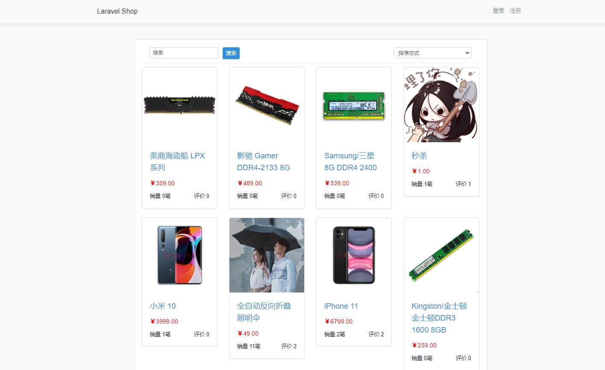
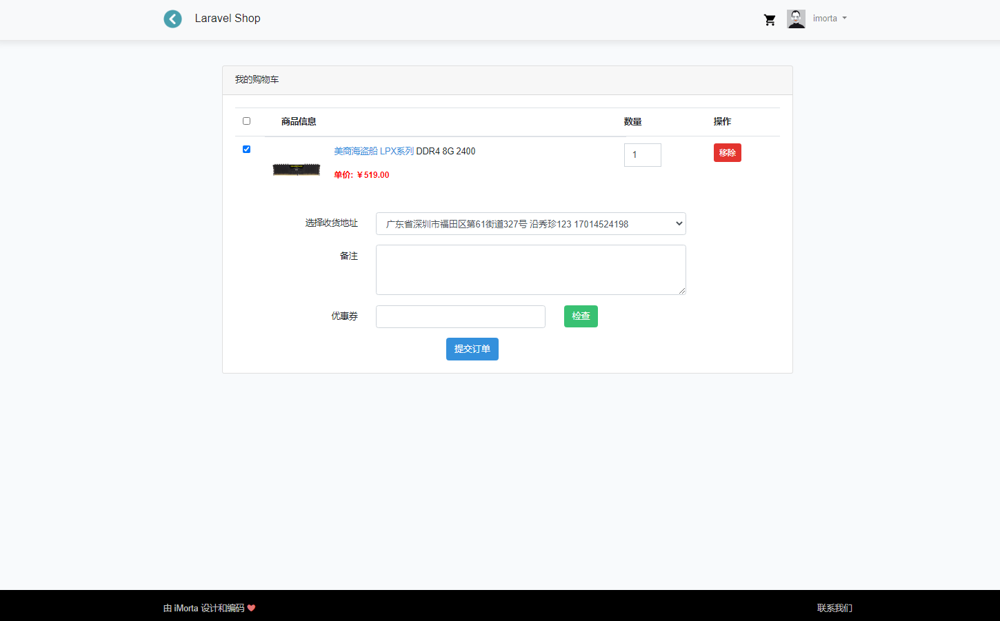
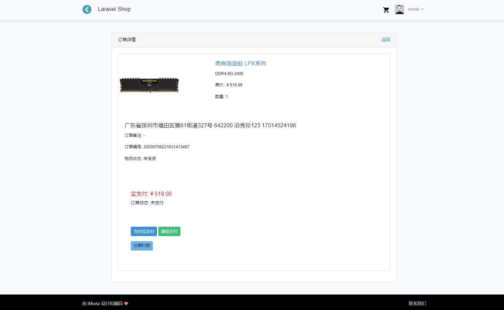
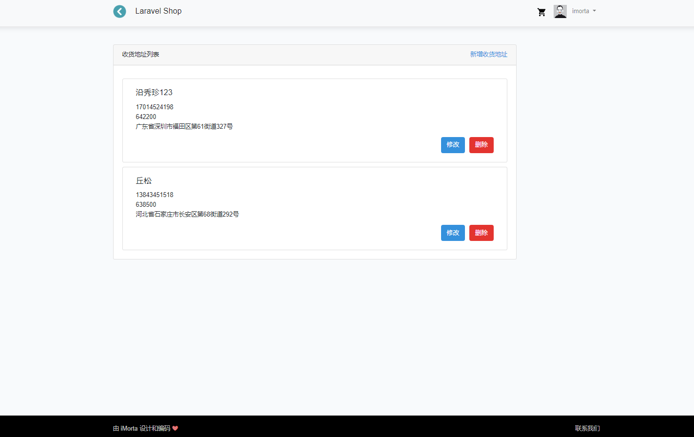
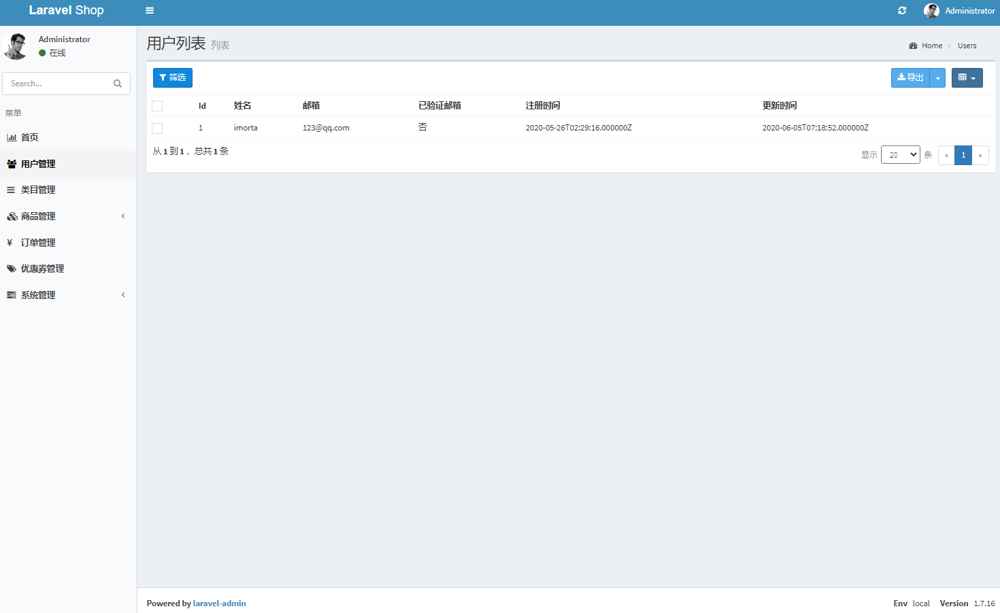

# LaravelShop


<a href="https://packagist.org/packages/laravel/framework"></a>
<a href="https://packagist.org/packages/laravel/framework"></a>
[](https://www.php.net)


 基于 Laravel 一步一步构建一套电商系统。使用 Laravel-Admin 快速构建管理后台、支付宝和微信支付的回调通知处理、Laravel 项目中对异常的处理、购物车设计、商品 SKU 数据结构设计、通过延迟队列自动关闭订单、MySQL 事务处理、库存增减的正确姿势、无限级分类、Elasticsearch、分面搜索、代码部署、负载均衡、压力测试、接口性能优化、随机拒绝等电商开发相关的高级技术概念。

## 功能
- 用户中心；
- 收货地址；
- 电商管理后台；
- 权限管理；
- 商品管理；
- 商品 SKU；
- 购物车模块；
- 订单模块；
- 支付模块（支付宝、微信支付）；
- 商品评价；
- 商品收藏；
- 订单退款流程；
- 优惠券模块；
- 电商安全须知；
- 数据备份。
- 高性能无限级分类；
- 众筹商品管理；
- 众筹商品下单逻辑；
- 众筹商品结束逻辑；
- 使用分期付款支付订单；
- 计算分期付款逾期费；
- 分期付款订单的退款；
- 给商品增加属性；
- 使用 Elasticsearch 重构商品搜索模块；
- 分面搜索；
- 相似商品查询；
- Elasticsearch 的索引迁移；
- 秒杀商品管理；
- 秒杀商品下单逻辑；
- 秒杀接口性能优化；
- 编写部署脚本；
- 多机部署实现负载均衡。

## 运行环境要求
- Nginx 1.15+
- Mysql 5.7+
- PHP 7.2+
- Laravel 7.0+
- Redis 3.0+
- Elasticsearch 7.8


## 开发环境部署/安装
本项目代码使用 PHP 框架 Laravel 7.0 开发，本地开发环境使用 PHPEnv。


## 运行效果








## Install Laravel-shop

### 安装PHP依赖
```bash
composer config -g repo.packagist composer https://packagist.laravel-china.org
composer install
```
### 安装 Nodejs 依赖
```bash
yarn config set registry https://registry.npm.taobao.org
SASS_BINARY_SITE=http://npm.taobao.org/mirrors/node-sass yarn
yarn dev
```

### 配置 .env 文件
```bash
cp .env.example .env
vim .env

APP_NAME="Laravel Shop"
DB_DATABASE=laravel-shop
APP_URL=http://shop.test
QUEUE_DRIVER=redis
DB_HOST=127.0.0.1
DB_PORT=3306
DB_DATABASE=laravel-shop
DB_USERNAME=root
DB_PASSWORD=123456
ADMIN_HTTPS=true
ES_HOSTS=localhost:9200
```
然后我们通过 Laravel 的命令自动生成 APP_KEY 值：
```bash
php artisan key:generate
```

### 创建软链
接下来我们需要在 public 目录下创建一个连到 storage/app/public 目录下的软链接：
```bash
php artisan storage:link
```

### 初始化数据库
```bash
php artisan migrate
mysql laravel-shop < database/laravel-shop.sql
```

### 创建ES迁移同步
```bash
php artisan es:migrate
php artisan es:sync-products
```
- 管理后台初始账号：admin 密码：admin，后台地址为 http://shop.test/admin。

### 支付宝 微信 APPID配置
`config/pay.php` 请自定义配置
```bash
'alipay' => [
        'app_id'            =>  '',
        'ali_public_key'    =>  '',
        'private_key'       =>  '',
        'log'               =>  [
            'file' => storage_path('logs/alipay.log')
        ],
    ],
    'wechat' => [
        'app_id'        => '',
        'mch_id'        => '',
        'key'           => '',
        'cert_key'      => '',
        'log'           => [
            'file' => storage_path('logs/wechat.log')
        ]
    ]
```


### 最后
使用 `horizon` 能在后台查看job情况
```bash
php artisan horizon
```
http://shop.test/horizon


## License
The Laravel framework is open-sourced software licensed under the MIT [license](https://opensource.org/licenses/MIT).
